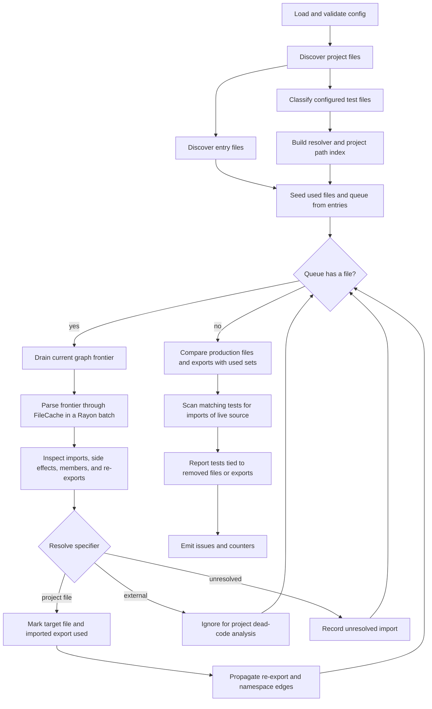
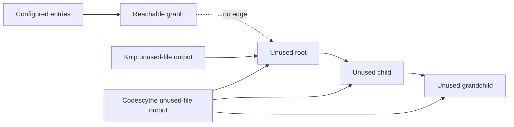

# Architecture

Codescythe is a focused TypeScript dead-code analyzer. The core algorithm lives
in `crates/codescythe`; the CLI, N-API binding, and npm package are thin
runtime adapters around that library.

The analyzer keeps two related but separate pieces of state:

- File reachability: which configured project files are reachable from the
  configured entry files.
- Export usage: which named exports from reachable project files are actually
  imported or re-exported by reachable code.

This split lets Codescythe report both unused files and unused exports without
requiring a TypeScript type checker or framework-specific plugins.

## Pipeline



`codescythe::run(cwd, config_path)` loads config and calls `analyze_path`.
`codescythe::run_and_fix(cwd, config_path)` runs the same analysis, then applies
supported unused-file and export removals.

## Profiling

Profiling is compiled behind the `profiling` Cargo feature so default release
builds do not carry profiler timers, counters, or resolver hot-path branches.
Build the profiling binary explicitly, then set `CODESCYTHE_PROFILE=1` to print
stage timings and high-level counters to stderr. The profile output is
intentionally outside JSON stdout, so it can be used with `--json` and
redirected independently:

```sh
bazel build -c opt //crates/codescythe_cli:codescythe_profiling
CODESCYTHE_PROFILE=1 bazel-bin/crates/codescythe_cli/codescythe_profiling \
  --json --directory <repo> --config <config> \
  > report.json 2> profile.txt
```

The profiler reports discovery, entry classification, resolver setup, reachable
graph traversal, issue construction, test scans, optional explanation work, and
finalization. It also breaks graph traversal into frontier parse time and
frontier inspection time, and includes resolver call counts, cache hits/misses,
classification counts, and uncached resolver wall time. The CLI adds JSON
serialization timing for JSON output.

The current Kibana fixture is a useful stress test because its benchmark config
marks every configured source root as an entry. A representative local run
processed 90,929 project files, treated all 90,929 as entries, parsed all
90,929, found no unused files, and reported 54,316 unused exports. Before
grouped import resolution, the same config spent 14.68s total, including 11.64s
walking the reachable graph, 4.33s in graph-frontier parsing, and 7.31s in
frontier inspection. The resolver saw 1,789,125 calls, 1,365,734 cache hits,
423,391 cache misses, and 5.48s in uncached resolution. After deduplicating
parser records and grouping static imports by source before resolution, the run
spent 11.48s total, 9.81s walking the reachable graph, 3.94s in frontier
parsing, and 5.88s in frontier inspection. Resolver calls dropped to 1,035,474
while the 423,391 unique misses stayed unchanged, and uncached resolver time
fell to 4.53s.

Those numbers shape the optimization priorities:

- File reads and parsing are not repeated for the same file inside one analysis
  run; `FileCache` parses each file at most once.
- JSON serialization is not a meaningful bottleneck for the current 7 MB Kibana
  report.
- Since the benchmark config makes the whole project reachable, entry pruning
  cannot help this fixture. It can still matter for real configs with narrower
  entries.
- Grouping static imports by source removes repeated resolver cache-hit traffic
  inside each importer. Resolver work remains important after that because
  Kibana still has more than 400k unique importer/specifier misses in the
  resolution cache.
- Small object-copy, line/column, and output-format experiments have not shown a
  reliable memory win; the higher-value work is reducing resolver misses,
  reducing graph inspection work, or changing the configured entry surface when
  coverage allows it.

## Config Loading

`load_config` accepts an analysis root and an optional config path.

When a config path is passed, Codescythe reads that file. If the file is named
`package.json`, it reads the nested `codescythe` object from it. Paths ending in
`.jsonc` are parsed as JSONC.

Without an explicit config path, Codescythe checks:

1. `codescythe.json` in the analysis root.
2. `codescythe.jsonc` in the analysis root.
3. A `codescythe` object in `package.json`.
4. The default config.

Config is validated against the bundled `codescythe.schema.json`. Pattern fields
accept either a string or an array of strings. If `project` is empty, it defaults
to:

```json
"**/*.{ts,tsx,js,jsx,mts,cts}"
```

The loader always adds built-in ignores for `.git`, Bazel symlink trees,
`node_modules`, `dist`, `build`, and `coverage`.

If `testFilePatterns` is omitted, it defaults to `**/*.test.*`. Matching files
stay in the project file set, but Codescythe treats them as leaf files: their
imports do not mark production files or exports used. Detached end-to-end specs
should be modeled as entries, so `.spec.*` files are intentionally not included
in the default test-file pattern.

Project discovery uses Rust's `ignore` crate to automatically discover
`.gitignore` files in every traversed directory. Configured `ignore` globs and
built-in ignores remain exclude-only, while gitignore matchers preserve
gitignore parsing and negation semantics.

`aliases` config is passed into `oxc_resolver` and overrides package-level
imports for matching specifiers. `unresolvedImports` controls whether actionable
unresolved imports are reported, ignored, or treated as errors, with optional
specifier globs for suppressing known virtual imports.

Ignored unresolved imports are recorded after resolver attempts complete. In
verbose output, `ignoredUnresolvedImportsByPattern` groups each ignore pattern
with counts and sample importer/specifier pairs. This keeps generated namespace
suppressions visible and prevents ignored unresolved edges from looking like the
same confidence level as proved-unused code.

The `doctor` command runs the same resolver-backed analysis and samples
unresolved imports into `unresolvedImports`. Each sample records the importer,
specifier, resolver error, matching source aliases, expanded alias targets, and
candidate files with `exists` and `inProject` booleans. This makes alias misses
self-diagnosing without requiring a separate reproduction run.

Codescythe treats unresolved-ignore patterns that overlap local source aliases
from `package.json#imports` or `aliases` as risky. Normal analysis emits a
warning. `--fix` refuses source-like overlaps, meaning extensionless and
JS/TS-family patterns that can hide real source imports, unless `--force` is
used. Non-JS/TS asset patterns such as `*.svg?raw` still warn but do not block
`--fix`. Export edits are skipped when retained ignored-unresolved diagnostics
match an exporting file's alias namespace.

The CLI and N-API adapter both derive the analysis root the same way: an explicit
directory or `cwd` option wins, otherwise a config file's parent directory wins,
otherwise the current process directory is used.

## Project File Discovery

`discover_project_files` walks the analysis root with `walkdir` and follows
links. Directory traversal is pruned early for common non-project directories:
`.git`, `node_modules`, `target`, `dist`, `build`, `coverage`, and any directory
whose name starts with `bazel-`. Directories matching the configured `ignore`
globs are also pruned before links are followed, so ignored cache or generated
trees cannot fail discovery through stale symlinks.

For each regular file, Codescythe computes a slash-normalized relative path and
keeps the file when:

- It matches the configured `project` glob set.
- It does not match the configured or built-in `ignore` glob set.

The resulting absolute paths are sorted before indexing, which keeps output
stable. Discovery is still eager because Codescythe needs the complete project
path set to report unused files, but source text is not read at this stage.

## Entry File Discovery

Entry files seed the reachability traversal.

When `entry` is configured, literal entry patterns are resolved relative to the
analysis root if the path exists. Glob entry patterns are matched against the
already discovered project files.

When `entry` is omitted, Codescythe infers entries from common package
entrypoints:

- `src/index.ts`, `src/index.tsx`, `src/index.js`
- `index.ts`, `index.tsx`, `index.js`
- `main`, `module`, `types`, and `bin` fields in `package.json`

Inferred entries are filtered to files that are also part of the project file
set. A configured literal entry must also be present in the project path index
before it can seed the traversal.

## Parsing

Project files are parsed lazily with Oxc. `analyze_path` builds a `FileCache`
from the discovered project paths, then parses files when the reachability walk
or export reporting needs their AST-derived metadata.

Reachability parsing happens in graph-frontier batches. Each traversal iteration
drains the current queue of reachable file indexes, parses any unparsed files in
that frontier with Rayon, then inspects the parsed files to discover the next
frontier. This keeps file reads and parsing parallel without reading files that
the dependency graph has not reached.

Parsing uses `SourceType::from_path` so the extension controls whether a file is
parsed as TypeScript, ESM, or CommonJS-flavored source. JavaScript-family files
are parsed with JSX enabled because large Babel-based codebases commonly keep
JSX in `.js` files. Each file is parsed at most once per analysis run.

The parse pool is capped by `CODESCYTHE_PARSE_THREADS` when set, then
`RAYON_NUM_THREADS`, then the host's available parallelism. Test files may be
parsed after the production graph settles so Codescythe can identify tests tied
to removed code and project-file imports tied to tests for live code.

The AST visitor stores one `FileData` record per parsed file. That record
deduplicates repeated dependency records while preserving first-seen order, then
contains:

- `exports`: exported symbols keyed by module export name.
- `imports`: named/default imports and destructured dynamic imports.
- `side_effect_imports`: bare imports, namespace imports, and string-literal
  dynamic imports.
- `namespace_imports`: local namespace binding to source specifier.
- `named_imports`: local named binding to imported source and export name.
- `member_uses`: static member expressions such as `Namespace.value`.
- `reexport_all`: sources from `export * from "./module"`.
- `local_references`: identifier references used by
  `ignoreExportsUsedInFile`.

Export records also keep their kind, source span, removal span, and re-export
metadata. The line and column reported to users are calculated from the export
name span after parsing.

## Import And Export Shapes

The visitor records these source forms:

- `import { value } from "./file"` marks export `value` from the resolved file.
- `import value from "./file"` marks export `default`.
- `import * as ns from "./file"` marks the target file reachable and records
  `ns` as a namespace binding.
- `import "./file"` marks the target file reachable but does not mark any export
  used.
- `const { value } = await import("./file")` marks export `value` from the
  resolved file. The string-literal `import()` expression also marks the file
  reachable.
- `export { value } from "./file"` marks the source file reachable and creates
  a re-export edge from the current export name to `value` in the source file.
- `export * from "./file"` records a star re-export source. When it is treated
  as public, all known exports from the source file are marked used.
- `export * as ns from "./file"` creates a namespace export. If reachable code
  later uses `ns.value`, Codescythe resolves the namespace source and marks
  `value` used there.

Namespace member tracking is intentionally syntactic. Codescythe recognizes
static member expressions where the object is an identifier, such as
`MyNamespace.x`; it does not try to evaluate computed property names or arbitrary
aliasing.

## Resolution

Codescythe delegates module resolution to `oxc_resolver`.

The resolver is configured with:

- The analysis root as `cwd`.
- automatic `tsconfig` discovery.
- `node` and `import` condition names.
- TypeScript, JavaScript, JSON, and native `.node` extensions.
- configured import aliases.
- extension aliases that let JavaScript specifiers resolve to TypeScript
  sources, such as `./file.js` resolving to `file.ts` or `file.tsx`.
- built-in Node modules enabled.
- `node_path` disabled.
- symlink preservation, so runfiles-style symlinked source trees can resolve
  back to the walked project paths.

After discovery, Codescythe builds a normalized path index from every project
file path. A resolved specifier is classified as:

- `Project` when the resolved path is in that index.
- `External` when resolution succeeds but points outside the project set, or
  when the specifier is a Node built-in or an ignored resolver result.
- `Unresolved` for selected resolver misses that should be actionable for a
  project import.

Missing bare package imports are generally treated as external misses instead of
project unresolved issues. Missing local paths, root-like paths, package imports
starting with `#`, and common alias forms such as `@/` and `~/` are reported as
unresolved.

## Reachability Algorithm

`analyze_path` seeds three mutable collections:

- `used_files`: indexes of project files reachable from entries.
- `used_exports`: a per-file set of module export names used by reachable code.
- `unresolved`: importer-relative paths mapped to unresolved specifiers.

It also keeps a FIFO queue of newly reachable file indexes. Test files are
inserted into `used_files` as leaf files and are not queued. Entry files are then
inserted into `used_files`; non-test entries are queued first. Each loop drains
the current queue as a graph frontier, batch-parses that frontier through
`FileCache`, then processes the parsed files. Newly discovered non-test project
files become the next frontier.

For each queued file, Codescythe:

1. Groups named/default imports and side-effect imports by source specifier,
   then resolves each source once for the file. Project targets are marked
   reachable, queued the first time they become reachable, and have any imported
   export names added to `used_exports`. Side-effect-only sources mark only the
   target file.
2. Applies namespace member usage. A recorded `Namespace.member` use marks
   `member` on the namespace source. If a named import refers to a namespace
   re-export, member usage is forwarded through that namespace export.
3. Resolves re-export source files and marks them reachable without marking
   their exported names used. File reachability follows the dependency graph,
   while export liveness remains symbol-specific.
4. Treats entry-file exports as public API when `includeEntryExports` is false.
   Own exports from those entry files are skipped during issue reporting, while
   re-exported sources are marked so public barrel files keep their targets
   alive.
5. Propagates any currently used re-exported names. If `file.ts` exports
   `{ value } from "./source"`, and reachable code imports `value` from
   `file.ts`, then `value` is marked used in `source`.

A project file is queued only the first time it becomes reachable. Export-use
state is still accumulated for final reporting, and re-export propagation is
performed while a reachable file is being processed. Some propagation paths,
such as `export * from "./source"` and namespace re-exports, may parse the
target immediately because they need to inspect the target's export table before
the next frontier is processed.

## Issue Generation

After traversal, Codescythe compares the complete project file list against the
used sets.

A file is reported under `issues.files` when it is neither reachable nor an
entry file. By default, exports inside unreachable files are not also reported,
which keeps output focused on the larger dead file and avoids reading or parsing
that file at all. The internal `AnalysisOptions::include_unreachable_exports`
option can include those export issues when callers need the extra detail; that
mode parses otherwise unreachable files during issue generation.

Test files are skipped for export reporting. After production file/export issues
are known, Codescythe parses matching test files. Tests that import reachable
non-test project source can keep their project-file imports out of the
unused-file report. Tests that import a project file or export still scheduled
for removal are reported instead. That keeps tests from counting as production
usage while letting `--fix` remove tests attached to the dead code being
removed.

An export is reported under `issues.exports` when:

- The file is eligible for export reporting.
- The export name is absent from that file's `used_exports` set.
- `ignoreExportsUsedInFile` is false, or the export's local declaration name is
  not referenced inside the declaring file.

Entry-file exports are skipped unless `includeEntryExports` is true.

Unresolved imports are filtered through the configured unresolved-import policy
and sorted per importer before they are added to the final report. Counters are
derived from the final issue maps plus the discovered project-file count.

## Differences From Knip

Codescythe uses Knip as a conformance reference for the TypeScript source graph,
but it does not try to clone Knip's full product surface.

The biggest intentional difference is unused-file reporting. Knip tends to
report the roots of dead islands. If an unused file imports another unused file,
Knip may report the importer and suppress the imported child. Codescythe reports
every project file that is unreachable from the configured entries. That means
Codescythe can be a strict superset of Knip for dead subgraphs, while still
remaining safe: a Codescythe-only unused file should have no importer that
Codescythe considers reachable.



Knip also has framework plugins, package-script parsing, package metadata
entrypoints, dependency reporting, and workspace inference. Codescythe is
source-graph oriented: it follows configured entries, configured project globs,
static imports, dynamic string imports, and re-exports. If a framework or
package script should be part of the graph, it needs to be modeled as an entry
or import in Codescythe's config.

The vendored conformance tests therefore run Knip in a narrowed mode: framework
plugins are disabled and the copied fixture's root manifest is stripped of
package/workspace entry metadata. The tests assert that every Knip unused file
is reported by Codescythe, every injected synthetic unused file is reported by
both tools, every injected synthetic unused export in a reachable file is
reported by Codescythe, and `codescythe --fix` can remove the synthetic files
and exports without touching the original fixture checkout. Their stable
summaries are checked against `benchmarks/*_conformance.snapshot.json`.

## Fixing

`apply_fixes` removes unused files and unused exports.

Unused files come from the analysis report's `issues.files` map. The fix path
removes those project files directly before editing reachable files that still
have unused export issues.

Fixing is intentionally one analysis-and-edit pass. Removing files can expose
additional unreachable files or exports, which a follow-up run will report.

Each export issue carries a parser span for the declaration or export statement
that introduced it. Fixing expands each span to full lines, merges overlapping
ranges, and applies replacements from the end of the file toward the beginning
so earlier byte offsets stay valid.

Because removal ranges are statement-based, multiple exports declared in the
same export statement share the same removal span. The fix path is intentionally
small and should stay backed by conformance fixtures before it grows more
granular editing behavior.

## Design Boundaries

Codescythe's analysis is deterministic and source-graph oriented:

- It only analyzes files inside the configured project set.
- It does not inspect framework config, package scripts, dependency usage, or
  generated runtime entrypoints unless those files are modeled as entries or
  imports.
- It treats configured test files as leaves: matching tests for live code can
  preserve their project-file imports, but they do not keep production exports
  alive.
- It uses AST syntax plus module resolution, not TypeScript type-checker
  symbol resolution.
- It treats external packages and Node built-ins as outside the project graph.
- It favors stable, explainable output over broad plugin inference.
