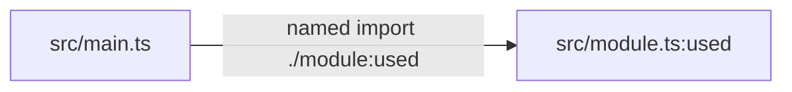
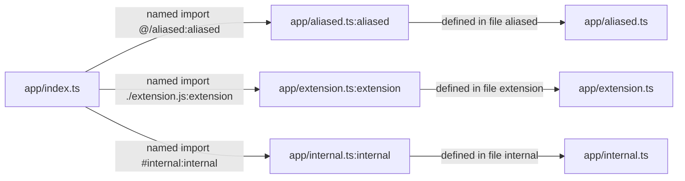

# Codescythe

Codescythe is a focused TypeScript and JavaScript dead-code analyzer and
remover inspired by [Knip](https://knip.dev), scoped to entry/project graph
analysis and unused source exports/files. It intentionally avoids Knip's
framework plugin surface.

It exists for TypeScript-heavy JavaScript codebases that want a smaller, more
predictable cleanup tool: start from known entry points, follow the
import/export graph, and identify project files or exported symbols that nothing
reachable uses. Many dead-code tools grow into broad framework integration
layers; Codescythe chooses a narrower contract so the analysis is easier to
reason about, test, and run as part of automated cleanup.

The goal is not to replace Knip for every framework-aware audit. Codescythe is
for the common package and monorepo maintenance job where the project boundary is
already known and the useful answer is deterministic: which source files and
exports are unused, and which of those removals can be applied safely.

## Codescythe And Knip

Codescythe takes a deliberately smaller slice of Knip's problem space.

| | Knip | Codescythe |
| --- | --- | --- |
| Primary scope | Broad JavaScript and TypeScript project hygiene: unused files, exports, dependencies, binaries, unresolved imports, and related issue types. | Focused TypeScript/JavaScript dead-code analysis: unused project files, unused exports, unresolved imports, and supported removals. |
| Project discovery | Infers more from package metadata, workspaces, scripts, framework config, and built-in plugins. | Starts from explicit `entry` and `project` config, then follows the import/export graph. |
| Framework awareness | Designed for framework and tool integrations through plugins and compilers. | Intentionally avoids a framework plugin surface. |
| Best fit | Comprehensive audits where framework config, dependency hygiene, and workspace conventions matter. | Deterministic cleanup jobs where the source boundary is already known and repeatable graph behavior matters more than integration breadth. |

## Benchmarks

The benchmark suite runs Codescythe and Knip against pinned real-world
TypeScript-heavy repositories fetched through Bazel. Representative local runs
produced:

| Fixture | Benchmarked files | Codescythe | Knip |
| --- | ---: | ---: | ---: |
| `microsoft/vscode` | 9,398 | 1.11s | 4.22s |
| `grafana/grafana` | 8,358 | 833.2ms | 9.51s |
| `elastic/kibana` | 90,931 | 13.61s | 43.04s |
| `renovatebot/renovate` | 2,456 | 154.5ms | 900.5ms |

Counts reflect each fixture's generated benchmark config after excludes. Run
`pnpm benchmark` to measure the same fixtures locally.

## Config

The canonical config schema lives at root `codescythe.schema.json`. Bazel keeps
the crate-local `crates/codescythe/codescythe.schema.json` copy in sync with
`write_source_file`, and that crate-local copy is compiled into the core crate.
Config can be provided as:

- `codescythe.json` in the project root.
- `codescythe.jsonc` in the project root, when `codescythe.json` is absent.
- A `codescythe` object in `package.json`.
- An explicit `.json` or `.jsonc` path passed with `--config`.

Supported config fields are `entry`, `project`, `testFilePatterns`, `ignore`,
`aliases`, `unresolvedImports`, `importConflicts`, `includeEntryExports`, and
`ignoreExportsUsedInFile`. Codescythe automatically discovers `.gitignore` files
in every traversed directory.

Files matching `testFilePatterns` are treated as leaf files. By default this
includes `**/*.test.*`: those files are kept out of production usage marking,
but `--fix` can remove them when they import a project file or export that
Codescythe is removing. When a matching test imports live production source, its
project-file imports are also kept out of the unused-file report. `.spec.*`
files are not matched by default; model detached end-to-end specs as entries
instead.

Exports annotated with a leading JSDoc `@internal` tag are the exception to the
test leaf rule. If a matching test imports an `@internal` export, Codescythe
keeps that export and its reachable dependency graph. If the `@internal` export
is not used by production code or tests, it is still reported as unused. Verbose
analysis and `--explain-export` show test importers that kept an internal export
alive, and `codescythe doctor` lists internal exports preserved by tests.
Importer and explain reasons are serialized as `{ code, description }` objects
with fixed `code` values so JSON consumers can branch on stable reason codes
instead of parsing display text.

Use `--verbose --json` when validating config changes or comparing runs. Verbose
analysis includes the Codescythe version, config path, project and entry counts,
package import keys, ignored unresolved-import patterns, source-alias ignore
warnings, and explanations for unused exports. Ignored unresolved imports are
grouped under `ignoredUnresolvedImportsByPattern` with sample specifiers and
importer files, so generated-import suppressions are visible instead of being
silent.

The source graph includes static imports and re-exports, string-literal dynamic
imports, destructured `require("./module")` calls, and `import.meta.glob`
patterns. `import.meta.glob` marks the matched project files and their exports
as used; computed patterns and non-literal dynamic imports remain outside the
supported graph.

## Fixing

Run Codescythe with `--fix` to apply supported removals. The fix pass removes
unused project files and removes unused export declarations from reachable files.
The JSON fix report includes `removedFiles`, `changedFiles`, `removedExports`,
and the original analysis result.

`--fix` refuses source-like unresolved-import ignore patterns that overlap
package `imports` or configured source aliases unless `--force` is provided.
Extensionless and JS/TS-family patterns can hide real source imports, while
non-JS/TS asset patterns such as `*.svg?raw` still warn but do not block
`--fix`. When ignored unresolved imports create alias-namespace uncertainty for
a file, Codescythe skips export edits for that file and reports it in
`skippedExportFiles`.

Fixing is a single analysis-and-edit pass. Removing a dead file can make more
files or exports unreachable, so repeated cleanup jobs should run Codescythe
again after a fix pass when a completely stable tree is required.

## Explanations And Doctor

Use `--explain-export <file>:<symbol>` to ask why one export is dead or alive:

```sh
codescythe --explain-export src/constants.ts:getServerId
```

Use `doctor` to check config risk before running destructive fixes:

```sh
codescythe doctor --config codescythe.jsonc
```

The doctor flags broad unresolved-import ignores under local aliases, unresolved
imports, entry patterns with zero matches, project scopes that appear much
broader than entry coverage, and generated ignore patterns that also match
checked source files. When unresolved imports are present, JSON doctor output
includes sampled resolver diagnostics with matched aliases, expanded targets,
candidate files, and whether each candidate exists in the project.

## Querying Dependency Paths

Use `query` to inspect dependency paths through the same source graph:

```sh
codescythe query somepath src/main.ts src/module.ts
codescythe query somepath src/main.ts src/features/
codescythe query allpaths src/main.ts src/runtime.ts:initRuntime --json
codescythe query allpaths src/main.ts src/runtime.ts:initRuntime --output mermaid
codescythe query allpaths src/main.ts src/runtime.ts:initRuntime --output svg > graph.svg
codescythe query import-conflicts
```

Selectors can point at files, directories, or exported symbols written as
`<file>:<symbol>`. Relative selectors are resolved from the analysis root chosen
by `-C` or `--config`.

- `somepath` returns one shortest path per reachable matched target. File and
  export targets usually match one target, while directory targets can match
  many.
- `allpaths` returns the subgraph of every node and edge that lies on a path
  from the source selector to the target selector.
- `import-conflicts` lists modules reached through both runtime-static and
  dynamic paths from the same configured entrypoint, including every conflicting
  importer and specifier plus one shortest proof route. Type-only and configured
  test-file imports do not count. It exits with status `1` when conflicts are
  found and supports `--json` for CI or bulk cleanup.

### Finding Static/Dynamic Import Conflicts

Use `import-conflicts` when a module intended as a lazy boundary may also be
pulled into the runtime graph eagerly:

```sh
codescythe query import-conflicts -C . --config codescythe.json
```

Each finding names the resolved target, then prints every runtime-static and
dynamic edge that reaches it:

```text
Found 1 module with runtime static/dynamic import conflicts:

src/module.ts
  runtime static imports:
    src/main.ts -- named import ./module
  dynamic imports:
    src/main.ts -- dynamic import ./module
  shortest conflicting entrypoint route (src/main.ts):
    runtime static path:
      src/main.ts
      -- named import ./module:value -> src/module.ts:value
      -- defined in file value -> src/module.ts
    dynamic path:
      src/main.ts
      -- dynamic import ./module -> src/module.ts
```

Runtime-static edges include named imports, side-effect imports, re-exports,
and namespace imports or member access. Dynamic edges come from supported
string-literal `import()` calls. `import type` edges are reported as
`typeImport` by path queries but do not affect bundling, so they are excluded
from conflict findings. Configured test files are also excluded.

A finding is reported only when one configured entrypoint can reach the target
through runtime-static edges and can also reach a dynamic importer of that
target. The printed route is the shortest deterministic proof: one fully static
path from the entrypoint to the target, plus one runtime path ending at the
conflicting dynamic import. This avoids treating imports isolated in separate
entrypoint graphs as conflicts.

Use `importConflicts.entry` when bundle roots differ from the top-level
dead-code analysis roots. When most roots are shared, use
`importConflicts.excludeEntry` to omit only liveness-only or staged roots:

```json
{
  "entry": ["src/apps/**/*.ts", "src/staged/**/*.ts"],
  "importConflicts": {
    "excludeEntry": ["src/staged/**"]
  }
}
```

An empty or omitted `importConflicts.entry` falls back to top-level `entry`.
These settings change only `query import-conflicts`; normal analysis keeps using
every top-level entry.

When a dedicated entrypoint intentionally preloads a module that remains lazy
for other entrypoints, suppress that static import edge with a required reason:

```ts
// codescythe-ignore-next-line import-conflict -- dedicated entrypoint preload
import { Page } from "./Page";
```

The edge remains in graph traversal, so conflicts below the preloaded module
still report. Only the annotated importer and resolved target pair is
suppressed. Another unsuppressed static path to the same target still reports.
Text output reports the number of suppressed modules, and JSON exposes it as
`suppressedConflictCount`.

The command exits with status `1` when findings exist and `0` when the scan is
clean. Use `--json` for CI or scripted cleanup:

```json
{
  "scannedFileCount": 2,
  "entrypointCount": 1,
  "suppressedConflictCount": 0,
  "conflicts": [
    {
      "target": "src/module.ts",
      "runtimeStaticImports": [
        {
          "importer": "src/main.ts",
          "specifier": "./module",
          "kind": "namedImport"
        }
      ],
      "dynamicImports": [
        {
          "importer": "src/main.ts",
          "specifier": "./module",
          "kind": "dynamicImport"
        }
      ],
      "entrypointRoute": {
        "entrypoint": "src/main.ts",
        "runtimeStaticPath": {
          "nodes": [
            { "id": "file:src/main.ts", "kind": "file", "path": "src/main.ts" },
            { "id": "export:src/module.ts:value", "kind": "export", "path": "src/module.ts", "symbol": "value" },
            { "id": "file:src/module.ts", "kind": "file", "path": "src/module.ts" }
          ],
          "edges": [
            {
              "from": "file:src/main.ts",
              "to": "export:src/module.ts:value",
              "kind": "namedImport",
              "importer": "src/main.ts",
              "specifier": "./module",
              "imported": "value"
            },
            {
              "from": "export:src/module.ts:value",
              "to": "file:src/module.ts",
              "kind": "exportDefinition",
              "imported": "value"
            }
          ]
        },
        "dynamicPath": {
          "nodes": [
            { "id": "file:src/main.ts", "kind": "file", "path": "src/main.ts" },
            { "id": "file:src/module.ts", "kind": "file", "path": "src/module.ts" }
          ],
          "edges": [
            {
              "from": "file:src/main.ts",
              "to": "file:src/module.ts",
              "kind": "dynamicImport",
              "importer": "src/main.ts",
              "specifier": "./module"
            }
          ]
        }
      }
    }
  ]
}
```

Fix the listed runtime-static edges, rerun the command, and confirm the target
disappears. Entrypoint reachability follows Codescythe's source graph, not
bundler-specific chunk naming, shared-chunk extraction, or preload behavior.
Use a production bundle inspection when you need proof of emitted boundaries
and transferred bytes.

Text output is optimized for terminal inspection, including the resolved
selector kinds, match counts, and a reachability summary that helps explain
no-path results. JSON output includes the same diagnostics, stable file/export
nodes, and typed import or re-export edges. Type-only imports use the
`typeImport` edge kind so they are not mistaken for runtime bundle edges. Pass
`--include-unresolved` when you also need every unresolved import discovered
while building the source graph, or `--include-unresolved=related` to limit
diagnostics to unresolved
imports from the query endpoints and returned path graph. Mermaid output renders
the same query graph as a `flowchart LR` diagram, and SVG output renders that
Mermaid source with the pure-Rust `mermaid-rs-renderer` crate.

`somepath` uses breadth-first search with visited nodes, while `allpaths`
intersects forward reachability from the source with reverse reachability from
the target. That makes dependency cycles finite without enumerating every
possible walk through the graph.

Fixture-backed Mermaid examples:

```sh
codescythe query somepath \
  -C tests/fixtures/test-file-usage \
  --output mermaid \
  src/main.ts \
  src/module.ts:used
```



```sh
codescythe query somepath \
  -C tests/fixtures/oxc-resolution \
  --output mermaid \
  app/index.ts \
  app/
```



```sh
codescythe query allpaths \
  -C tests/fixtures/knip-export-basics \
  --output mermaid \
  index.ts \
  my-namespace.ts:y
```


```sh
codescythe query somepath \
  -C tests/fixtures/runfiles-fixture \
  --output mermaid \
  workspace/frontend/apps/client/platform/platformRuntime.ts \
  protobuf/generated/client.ts:client
```


## Contributing

See [CONTRIBUTING.md](CONTRIBUTING.md) for the repository layout, architecture,
build graph, benchmarks, release artifacts, and local validation commands.
